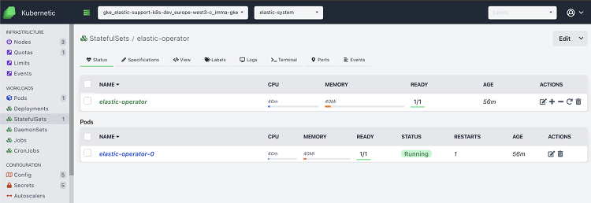

# Deploying the Elastic Stack with ECK on GKE

This project contains instructions on how to install [ECK](https://www.elastic.co/guide/en/cloud-on-k8s/current/index.html) on Google's managed kubernetes ([GKE](https://console.cloud.google.com/kubernetes/)) and test a few of its capabilities.

It's intended as a step by step guide to further investigate ECK capabilities on GKE, not for production.

## Pre-requisites

- [Google Cloud SDK](https://cloud.google.com/sdk/install) configured on your laptop.
- [kubectl](https://kubernetes.io/docs/tasks/tools/install-kubectl/). At the moment, ECK requires version 1.11+. See [ECK requirements](https://www.elastic.co/guide/en/cloud-on-k8s/1.0/k8s-quickstart.html).
- [kubernetic](https://kubernetic.com/) (*Optional*). Kubernetes Desktop Client.

## Create a GKE cluster

- Go to [google cloud console](https://console.cloud.google.com), select [Kubernetes Engine](https://console.cloud.google.com/kubernetes/list) on the drop-down menu and create a GKE cluster.
- Choose the options depending on your needs. If you want to get automatic k8s upgrades, choose release channel and the speed at which to update (rapid, regular, stable). Otherwise, choose a specific version. Install on a kubernetes 1.12+. **If you create a small cluster**, you might need to update the size to run this example. I usually run with **4 CPUs per node**, **15Gb RAM** each, as shown in the picture.

    

- Once the cluster is up and running, connect kubectl. Replace with the appropiate cluster name (in the example `imma-k8s-cluster`) and zone (`europe-west1-b` in the example). Hitting the `connect` button in the console will also give you this command.

    ```shell
    gcloud container clusters get-credentials imma-k8s-cluster --zone europe-west1-b
    ```

- This command will fetch your k8s cluster endpoint and configure kubectl accordingly. The output should look like this:

    ```shell
    Fetching cluster endpoint and auth data.
    kubeconfig entry generated for imma-k8s-cluster.
    ```

- We should now be able to inspect the cluster using [kubectl commands](https://kubernetes.io/docs/reference/kubectl/cheatsheet/). For the purpose of this guide, we'll use kubernetic, and we'll also provide the kubectl commands.

    

## ECK

- Installing ECK is a two step process. First we install the operator, and then we deploy our Elastic Stack (Elasticsearch, Kibana, APM, Beats, Enterprise Search). At the moment Logstash is not managed by the operator.
- After the Stack is installed, we will demonstrate a few of the operations available at the moment, like scaling and upgrading.

### Install ECK

- In order to deploy the operator, we have to setup google cloud RBAC with the following command:

    ```shell
    kubectl create clusterrolebinding \
    cluster-admin-binding \
    --clusterrole=cluster-admin \
    --user=$(gcloud auth list --filter=status:ACTIVE --format="value(account)")
    ```

    - With should result in:

        ```shell
        clusterrolebinding.rbac.authorization.k8s.io/cluster-admin-binding created
        ```

- Deploy the operator. For Kubernetes clusters running version 1.13 or higher:

    ```shell
    kubectl apply -f https://download.elastic.co/downloads/eck/1.2.0/all-in-one.yaml
    ```

- This will create the custom resources, cluster roles, namespace elastic-system, the operator, etc. for us.
- We can have a look at the operator logs:

    ```shell
    kubectl -n elastic-system logs -f statefulset.apps/elastic-operator
    ```

- Or get a description of the installed operator and each CustomResourceDefinition.

    ```shell
    kubectl -n elastic-system get statefulset.apps/elastic-operator

    kubectl -n elastic-system describe statefulset.apps/elastic-operator
    
    kubectl describe crd elasticsearch
    
    kubectl describe crd kibana
    
    kubectl describe crd apm

    kubectl describe crd beat

    kubectl describe crd enterprisesearch
    ```

- Alternatively, we can inspect with kubernetic the namespace `elastic-system`. Select it at the top (change `default` to `elastic-system`) and navigate the different resources that the operator created.

    

- The Stateful Sets contains our operator, and clicking on the operator pod we can view its logs.

    
    

- Feel free to inspect all the other resources that the operator created (service accounts, secrets, config map). With kubernetic, this is easier to explore.

### Installing the Elastic Stack

- We will now install an Elastic Stack defined in the following file: [basic-complete-elastic-stack.yaml](basic-complete-elastic-stack.yaml). You can check basic samples [here](https://github.com/elastic/cloud-on-k8s/tree/1.2/config/samples) and the documentation [here](https://www.elastic.co/guide/en/cloud-on-k8s/1.2/k8s-orchestrating-elastic-stack-applications.html).
- It's a simple definition for an Elastic Stack version 7.3.2, with a one-node Elasticsearch cluster, an APM a server and a single Kibana instance.
    - The Elasticsearch nodes in the example are configured to limit container resources to 2G memory and 1 CPU.
    - Pods can be [customized](https://www.elastic.co/guide/en/cloud-on-k8s/1.2/k8s-customize-pods.html) modifying the `pod template` to add parameters like the Elasticsearch heap. 
    - The deployment will also mount on a 5Gb volume claim. Check the documentation for [Volume Claim Templates](https://www.elastic.co/guide/en/cloud-on-k8s/1.2/k8s-volume-claim-templates.html).

    ```shell
    kubectl apply -f basic-complete-elastic-stack.yaml
    ```

- We can monitor the deployment via kubectl:

    ```shell
    kubectl get elasticsearch,kibana,apmserver,enterprisesearch,beat
    ```

- And check on the associated pods:

    ```shell
    kubectl get pods --selector='elasticsearch.k8s.elastic.co/cluster-name=elasticsearch-sample'
    kubectl get pods --selector='kibana.k8s.elastic.co/name=kibana-sample'
    kubectl get pods --selector='apm.k8s.elastic.co/name=apm-server-sample'
    kubectl get pods --selector='enterprisesearch.k8s.elastic.co/name=enterprise-search-sample'
    kubectl get pods --selector='beat.k8s.elastic.co/name=filebeat-sample'
    ```

- Or with kubernetic. Since we did not specify a `namespace`, the elastic stack was deployed on the `default` namespace (remember to change the selected namespace at the top). We can first visit our `Services` and make sure they are all started.

    

- Since we deployed kibana with a service type LoadBalancer, we should be able to retrieve the external public IP GKE provisioned for us and access Kibana.

    ```yaml
    http:
        service:
        spec:
            type: LoadBalancer
    ```

- In order to do that, either get the external IP executing `kubectl get svc`. In the example:

    ```shell
    NAME                                TYPE           CLUSTER-IP     EXTERNAL-IP      PORT(S)          AGE
    apm-server-sample-apm-http          ClusterIP      10.64.14.133   <none>           8200/TCP         2m49s
    elasticsearch-sample-es-default     ClusterIP      None           <none>           9200/TCP         2m49s
    elasticsearch-sample-es-http        ClusterIP      10.64.12.137   <none>           9200/TCP         2m55s
    elasticsearch-sample-es-transport   ClusterIP      None           <none>           9300/TCP         2m55s
    enterprise-search-sample-ent-http   LoadBalancer   10.64.2.108    35.195.186.161   3002:31650/TCP   2m52s
    kibana-sample-kb-http               LoadBalancer   10.64.2.42     34.77.8.197      5601:32061/TCP   2m52s
    kubernetes                          ClusterIP      10.64.0.1      <none>           443/TCP          62m
    ```

- Or get it with kubernetic, viewing the `kibana-sample-kb-http` service.  When the load balancer is provisioned, we will see the external IP under `status.loadBalancer.ingress.ip`.

    

- Once the external IP is available, we can visit our kibana at https://<EXTERNAL_IP>:5601/. In the example: https://34.77.8.197:5601/

- The certificate presented to us is self-signed one. We could have assigned a valid http certificate. See the [docs](https://www.elastic.co/guide/en/cloud-on-k8s/1.2/k8s-custom-http-certificate.html).

- The operator has created a secret for our superuser elastic. Let's go get it. Two options: via kubectl retrieve the password (remove the % at the end):

    ```shell
    kubectl get secret elasticsearch-sample-es-elastic-user -o=jsonpath='{.data.elastic}' | base64 --decode
    ```

    ```shell
    W1P0V8s4q477J0PR0SMO1jJo%
    ```

- Or visit the secrets section using kubernetic. Filter for `elastic-user` (top right) and get the password in plain text under the `Specifications` section.

    
    

- Now we can log-in to our kibana with user `elastic`, and the retrieved password. We recommend [loading some kibana sample data](https://www.elastic.co/guide/en/kibana/7.8å/add-sample-data.html), and [enabling self Stack Monitoring](https://www.elastic.co/guide/en/kibana/7.8/xpack-monitoring.html), so we can use the monitoring data in the following sections.

    

- To check that the deployed Filebeat is collectings logs from our Kubernetes cluster go to [Kibana Logs app](https://www.elastic.co/guide/en/logs/guide/7.8/logs-app-overview.html):

    

- We should also be able to log into our Enterprise Search. We can use port forwarding `kubectl get service enterprise-search-sample-ent-http` to access it from our local workstation. And access the url https://localhost:3002/. The certificate will not be a valid one, accept it and you should see the following screen:

    

    - You can login using the same `elastic` user and password we used for Kibana. Where you can choose between [Elastic App Search](https://www.elastic.co/app-search/) and [Elastic Workplace Search](https://www.elastic.co/workplace-search).

        

### Scaling Elasticsearch

- Now that we have our stack up and running, we can scale Elasticsearch from 1 to 3 nodes. If we look at the pod section in kubernetes, or at the deployed pods, we will see that our Elasticsearch has only one node.

    ```shell
    kubectl get pods
    ```

    ```shell
    NAME                                            READY   STATUS    RESTARTS   AGE
    apm-server-sample-apm-server-d5d9b44cf-r9cvr    1/1     Running   0          46m
    elasticsearch-sample-es-default-0               1/1     Running   0          46m
    enterprise-search-sample-ent-6ccc8798dc-ct628   1/1     Running   1          46m
    filebeat-sample-beat-filebeat-hxmjh             1/1     Running   0          46m
    filebeat-sample-beat-filebeat-ppfmg             1/1     Running   0          46m
    filebeat-sample-beat-filebeat-rvstc             1/1     Running   0          46m
    kibana-sample-kb-757d7cd667-dshlm               1/1     Running   0          46m
    ```

    

- To scale the Elastic Stack, edit the file [basic-complete-elastic-stack.yaml](basic-complete-elastic-stack.yaml) and set the Elasticsearch `nodeCount` to 3.

    ```yaml
    apiVersion: elasticsearch.k8s.elastic.co/v1
    kind: Elasticsearch
    metadata:
    name: elasticsearch-sample
    spec:
    version: 7.8.0
    nodeSets:
    - name: default
        count: 3
    ```

- Apply the changes:

    ```shell
    kubectl apply -f basic-complete-elastic-stack.yaml
    ```

- And monitor until the 3 pods are up and running. There is different options. Using kubectl command line, in the pods section of kubernetic, or in Kibana monitoring.

    ```shell
    kubectl get pods --selector='elasticsearch.k8s.elastic.co/cluster-name=elasticsearch-sample'

    NAME                                READY   STATUS     RESTARTS   AGE
    elasticsearch-sample-es-default-0   1/1     Running    0          49m
    elasticsearch-sample-es-default-1   0/1     Init:0/1   0          12s

    NAME                                READY   STATUS    RESTARTS   AGE
    elasticsearch-sample-es-default-0   1/1     Running   0          54m
    elasticsearch-sample-es-default-1   1/1     Running   0          5m26s
    elasticsearch-sample-es-default-2   1/1     Running   0          4m27s
    ```

    

    

    

- When ready, we will have a 3-node elasticsearch cluster, and the health should now be green (all index replicas assigned).

### Upgrading the Elastic Stack

- We can now proceed to upgrade the whole stack. It will just require to edit the file [basic-complete-elastic-stack.yaml](basic-complete-elastic-stack.yaml) and replace all the `version: 7.8.0` with, for example, `version: 7.8.1` in all services (elasticsearch, apm, kibana, enterprise search, beats).

    ```shell
    kubectl apply -f basic-complete-elastic-stack.yaml
    ```

- When we apply the changes, the operator will take care of the dependencies. For example, it will first update Elasticsearch and APM, and wait for Elasticsearch to complete to update Kibana. We can follow the process of pod creation using kubectl or kubernetic.

    ```shell
    kubectl get pods
    ```

    

- As a default, the operator will do a rolling upgrade, one Elasticsearch instance at a time.
    - ECK uses StatefulSet-based orchestration from version `1.0+`. StatefulSets with ECK allow for even faster upgrades and configuration changes, since upgrades use the same persistent volume, rather than replicating data to the new nodes.
    - We could also have changed the default [update strategy](https://www.elastic.co/guide/en/cloud-on-k8s/1.2/k8s-update-strategy.html) or the [Pod disruption budget](https://www.elastic.co/guide/en/cloud-on-k8s/1.2/k8s-pod-disruption-budget.html).

- After upgrading Elasticsearch, ECK will take care of upgrading the whole stack. For Kibana and APM it will create new pods in version `7.8.1` to replace the old ones version `7.8.0`.

- We can check the deployed instances using kubernetic. Visualizing any of the pod specifications we can see that they are now running version `7.8.1`.

    

- We can also see in the kibana monitoring UI the health of our cluster (green) with 3 nodes on version `7.8.1`

    

## Uninstall process

When we are done with the testing, it is recommended to follow the uninstall process to liberate resources.

### Delete elastic resources

- Remove elastic resources from all namespaces.

    ```shell
    kubectl delete elastic --all --all-namespaces
    ```
​
- Remove the operator.

    ```shell
    kubectl delete -f https://download.elastic.co/downloads/eck/1.2.0/all-in-one.yaml
    ```

### Delete GKE cluster

Login to Google Cloud Console and remove your Google Kubernetes Engine.