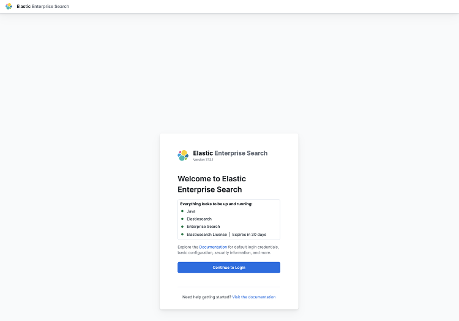
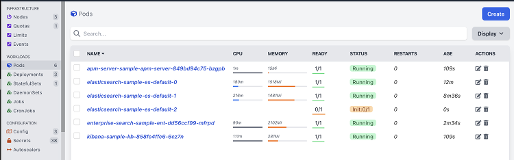
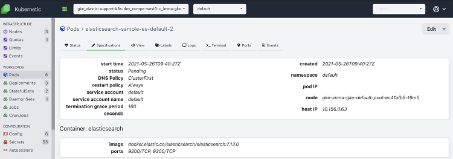
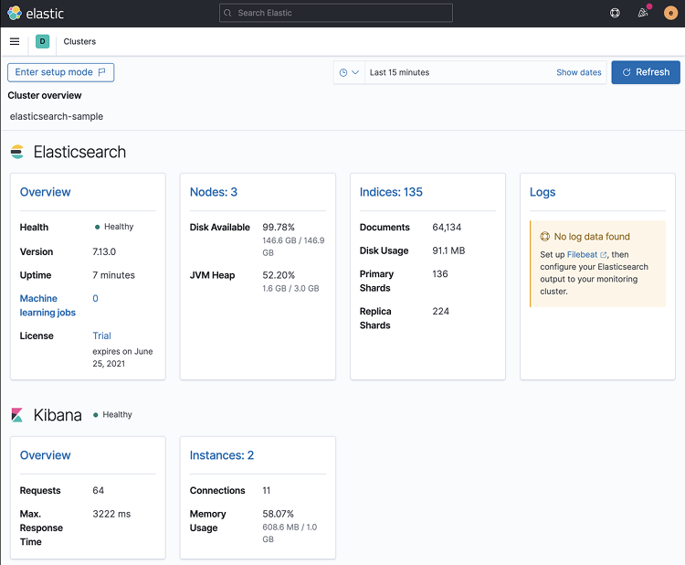

# Basic Elastic Stack Deployment

- Once we [installed GKE and ECK](../install-gke-and-eck.md), we can proceed to deploy a simple example.
- We will now install an Elastic Stack defined in the following file: [basic-complete-elastic-stack.yaml](basic-complete-elastic-stack.yaml). You can check basic samples [here](https://github.com/elastic/cloud-on-k8s/tree/1.5/config/samples) and the documentation [here](https://www.elastic.co/guide/en/cloud-on-k8s/1.5/k8s-orchestrating-elastic-stack-applications.html).
- It's a simple definition for an Elastic Stack version `7.11.2`, with a one-node Elasticsearch cluster, an APM server, EnterpriseSearch and a single Kibana instance.
    - The Elasticsearch nodes in the example are configured to limit container resources to 2G memory and 1 CPU.
    - Pods can be [customized](https://www.elastic.co/guide/en/cloud-on-k8s/1.5/k8s-customize-pods.html) modifying the `pod template` to add parameters like the Elasticsearch heap. 
    - The deployment will also mount on a 50Gb volume claim. Check the documentation for [Volume Claim Templates](https://www.elastic.co/guide/en/cloud-on-k8s/1.5/k8s-volume-claim-templates.html). Starting in version `1.3.0` ECK supports [Elasticsearch volume expansion](https://www.elastic.co/guide/en/cloud-on-k8s/1.3/release-notes-1.5.0.html#feature-1.3.0).

    ```shell
    kubectl apply -f basic-complete-elastic-stack.yaml
    ```

- We can monitor the deployment via `kubectl` until the components are healthy:

    ```shell
    kubectl get elasticsearch,kibana,apmserver,enterprisesearch
    ```

    ```shell
    NAME                                                              HEALTH    NODES   VERSION   PHASE             AGE
    elasticsearch.elasticsearch.k8s.elastic.co/elasticsearch-sample   unknown           7.11.2    ApplyingChanges   26s

    NAME                                         HEALTH   NODES   VERSION   AGE
    kibana.kibana.k8s.elastic.co/kibana-sample   red              7.11.2    26s

    NAME                                             HEALTH   NODES   VERSION   AGE
    apmserver.apm.k8s.elastic.co/apm-server-sample                              25s

    NAME                                                                        HEALTH   NODES   VERSION   AGE
    enterprisesearch.enterprisesearch.k8s.elastic.co/enterprise-search-sample   red              7.11.2    25s
    ```

    ```shell
    NAME                                                              HEALTH   NODES   VERSION   PHASE   AGE
    elasticsearch.elasticsearch.k8s.elastic.co/elasticsearch-sample   yellow   1       7.11.2    Ready   109s

    NAME                                         HEALTH   NODES   VERSION   AGE
    kibana.kibana.k8s.elastic.co/kibana-sample   green    1       7.11.2    109s

    NAME                                             HEALTH   NODES   VERSION   AGE
    apmserver.apm.k8s.elastic.co/apm-server-sample   green    1       7.11.2    108s

    NAME                                                                        HEALTH   NODES   VERSION   AGE
    enterprisesearch.enterprisesearch.k8s.elastic.co/enterprise-search-sample   red              7.11.2    108s
    ```

- And check on the associated pods:

    ```shell
    kubectl get pods --selector='elasticsearch.k8s.elastic.co/cluster-name=elasticsearch-sample'
    kubectl get pods --selector='kibana.k8s.elastic.co/name=kibana-sample'
    kubectl get pods --selector='apm.k8s.elastic.co/name=apm-server-sample'
    kubectl get pods --selector='enterprisesearch.k8s.elastic.co/name=enterprise-search-sample'
    ```

- Or with kubernetic. Since we did not specify a `namespace`, the elastic stack was deployed on the `default` namespace (remember to change the selected namespace at the top). We can first visit our `Services` and make sure they are all started.

    

- Since we deployed kibana with a service type `LoadBalancer`, we should be able to retrieve the external public IP GKE provisioned for us and access Kibana.

    ```yaml
    http:
        service:
        spec:
            type: LoadBalancer
    ```

- In order to do that, either get the external IP executing `kubectl get svc --selector='kibana.k8s.elastic.co/name=kibana-sample'`. In the example:

    ```shell
    NAME                                TYPE           CLUSTER-IP     EXTERNAL-IP      PORT(S)          AGE
    kibana-sample-kb-http               LoadBalancer   10.64.2.42     34.77.8.197      5601:32061/TCP   2m52s
    ```

- Or get it with kubernetic, viewing the `kibana-sample-kb-http` service.  When the [external Load Balancer](https://kubernetes.io/docs/tasks/access-application-cluster/create-external-load-balancer/#external-load-balancer-providers) is provisioned, we will see the external IP under `status.loadBalancer.ingress.ip`.

    

- Once the external IP is available, we can visit our kibana at https://<EXTERNAL_IP>:5601/. In the example: https://34.77.8.197:5601/. 

- The certificate presented to us is self-signed one and we'll have to bypass the browser warnings. We could have assigned a valid http certificate. See the [docs](https://www.elastic.co/guide/en/cloud-on-k8s/1.5/k8s-custom-http-certificate.html).

- The operator has created a secret for our superuser elastic. Let's go get it. Two options: via kubectl retrieve the password:

    ```shell
    echo $(kubectl get secret elasticsearch-sample-es-elastic-user -o=jsonpath='{.data.elastic}' | base64 --decode)
    ```

    ```shell
    W1P0V8s4q477J0PR0SMO1jJo
    ```

- Or visit the secrets section using kubernetic. Filter for `elastic-user` (top right) and get the password in plain text under the `Specifications` section.

    
    

- Now we can log-in to our kibana with user `elastic`, and the retrieved password. We recommend [loading some kibana sample data](https://www.elastic.co/guide/en/kibana/7.12/get-started.html#gs-get-data-into-kibana), and [enabling self Stack Monitoring](https://www.elastic.co/guide/en/kibana/7.12/xpack-monitoring.html), so we can use the monitoring data in the following sections. Self-monitoring is not recommended in production, and we'll use it here for demonstration purposes. See the [monitoring example](../monitoring/README.md).

    

- We should also be able to log into our Enterprise Search. We can use port forwarding `kubectl port-forward service/enterprise-search-sample-ent-http 3002` to access it from our local workstation. And access the url https://localhost:3002/. The certificate will not be a valid one, accept it and you should see the following screen:

    

    - You can login using the same `elastic` user and password we used for Kibana. Where you can choose between [Elastic App Search](https://www.elastic.co/app-search/) and [Elastic Workplace Search](https://www.elastic.co/workplace-search).

        

- Elasticsearch has not been published, though we can always use port forwarding to access our cluster directly. In production, consider [trafic splitting](https://www.elastic.co/guide/en/cloud-on-k8s/1.5/k8s-traffic-splitting.html) to allow clients to access Elaticsearch.

    ```shell
    kubectl port-forward service/elasticsearch-sample-es-http 9200
    ```

### Scaling Elasticsearch

- Now that we have our stack up and running, we can scale Elasticsearch from 1 to 3 nodes. If we look at the pod section in kubernetes, or at the deployed pods, we will see that our Elasticsearch has only one node.

    ```shell
    kubectl get pods
    ```

    ```shell
    NAME                                            READY   STATUS    RESTARTS   AGE
    apm-server-sample-apm-server-d5d9b44cf-r9cvr    1/1     Running   0          46m
    elasticsearch-sample-es-default-0               1/1     Running   0          46m
    enterprise-search-sample-ent-6ccc8798dc-ct628   1/1     Running   1          46m
    kibana-sample-kb-757d7cd667-dshlm               1/1     Running   0          46m
    ```

    

- To scale the Elastic Stack, edit the file [basic-complete-elastic-stack.yaml](basic-complete-elastic-stack.yaml) and set the Elasticsearch `nodeCount` to 3.

    ```yaml
    apiVersion: elasticsearch.k8s.elastic.co/v1
    kind: Elasticsearch
    metadata:
    name: elasticsearch-sample
    spec:
    version: 7.11.2
    nodeSets:
    - name: default
        count: 3
    ```

- Apply the changes:

    ```shell
    kubectl apply -f basic-complete-elastic-stack.yaml
    ```

    ```shell
    elasticsearch.elasticsearch.k8s.elastic.co/elasticsearch-sample configured
    kibana.kibana.k8s.elastic.co/kibana-sample unchanged
    apmserver.apm.k8s.elastic.co/apm-server-sample unchanged
    enterprisesearch.enterprisesearch.k8s.elastic.co/enterprise-search-sample unchanged
    ```

- And monitor until the 3 pods are up and running. There is different options. Using kubectl command line, in the pods section of kubernetic, or in Kibana monitoring.

    ```shell
    kubectl get pods --selector='elasticsearch.k8s.elastic.co/cluster-name=elasticsearch-sample'

    NAME                                READY   STATUS     RESTARTS   AGE
    elasticsearch-sample-es-default-0   1/1     Running    0          49m
    elasticsearch-sample-es-default-1   0/1     Init:0/1   0          12s

    NAME                                READY   STATUS    RESTARTS   AGE
    elasticsearch-sample-es-default-0   1/1     Running   0          54m
    elasticsearch-sample-es-default-1   1/1     Running   0          5m26s
    elasticsearch-sample-es-default-2   1/1     Running   0          4m27s
    ```

    

    

    

- When ready, we will have a 3-node elasticsearch cluster, and the health should now be green - all shard replicas assigned.

### Upgrading the Elastic Stack

- We can now proceed to upgrade the whole stack. It will just require to edit the file [basic-complete-elastic-stack.yaml](basic-complete-elastic-stack.yaml) and replace all the `version: 7.11.2` with, for example, `version: 7.12.1` on all services (elasticsearch, apm, kibana, enterprise search).

    ```shell
    kubectl apply -f basic-complete-elastic-stack.yaml
    ```

- When we apply the changes, the operator will take care of the dependencies. For example, it will first update Elasticsearch and APM, and wait for Elasticsearch to finish before upgrading Kibana. We can follow the process of pod creation using kubectl or kubernetic.

    ```shell
    kubectl get pods
    ```

    

- As a default, the operator will do a rolling upgrade, one Elasticsearch instance at a time. It will terminate an instance and restart it in the newer version.
    - ECK uses StatefulSet-based orchestration from version `1.0+`. StatefulSets with ECK allow for even faster upgrades and configuration changes, since upgrades use the same persistent volume, rather than replicating data to the new nodes.
    - We could also have changed the default [update strategy](https://www.elastic.co/guide/en/cloud-on-k8s/1.5/k8s-update-strategy.html) or the [Pod disruption budget](https://www.elastic.co/guide/en/cloud-on-k8s/1.5/k8s-pod-disruption-budget.html).

- After upgrading Elasticsearch, ECK will take care of upgrading the whole stack. For Kibana, Enterprise Search and APM it will create new pods in version `7.12.1` to replace the old ones version `7.11.2`.

- We can check the deployed instances using kubernetic. Visualizing any of the pod specifications we can see that they are now running version `7.12.1`.

    

- We can also see in the kibana monitoring UI the health of our cluster (green) with 3 nodes on version `7.12.1`

    

## Clean-up 

- When we are done with the testing, it is recommended to remove the deployments to release resources.
- Remove the Stack deployment:

    ```shell
    kubectl delete -f basic-complete-elastic-stack.yaml
    ```
​
- Make sure we removed all the resources:

    ```shell
    > kubectl get elastic
    No resources found in default namespace.

    > kubectl get service
    NAME                    TYPE           CLUSTER-IP      EXTERNAL-IP    PORT(S)          AGE
    kubernetes              ClusterIP      10.23.240.1     <none>         443/TCP          7d11h

    > kubectl get pvc
    No resources found in default namespace.
    ```