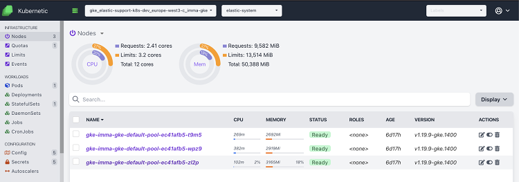

# Deploy a GKE Cluster and deploy ECK

## Create a GKE cluster

We can either create a GKE cluster using the following script:

```bash
#!/bin/bash
## Creates a GKE cluster

# Cluster attributes (GCP project, zone, name and sizing)
gcp_project="immas-k8s-project"
gcp_zone="europe-west3-c"
gke_cluster_name="imma-gke"
gke_cluster_nodes="3"
gke_cluster_node_vCPUs="4"
gke_cluster_node_RAM="16384"

# check if cluster exists, if not, create it https://cloud.google.com/sdk/gcloud/reference/container/clusters/create
if [[ $(gcloud container clusters list 2> /dev/null --project ${gcp_project} | grep ${gke_cluster_name} | wc -l) -gt 0 ]]
then echo "cluster ${gke_cluster_name} already exists"
else gcloud container clusters create ${gke_cluster_name} --project ${gcp_project} --zone=${gcp_zone} --num-nodes=$gke_cluster_nodes --machine-type=custom-$gke_cluster_node_vCPUs-$gke_cluster_node_RAM  --quiet;
fi

# Configure kubectkl context
gcloud container clusters get-credentials ${gke_cluster_name} --zone ${gcp_zone}  --project ${gcp_project}
```

Or using the Google Cloud Console.

- Go to [google cloud console](https://console.cloud.google.com), select [Kubernetes Engine](https://console.cloud.google.com/kubernetes/list) on the drop-down menu and create a GKE cluster.
- Choose the options depending on your needs. If you want to get automatic k8s upgrades, choose release channel and the speed at which to update (rapid, regular, stable). Otherwise, choose a specific version. Install on a kubernetes 1.12+. **If you create a small cluster**, you might need to update the size to run this example. I usually run with **4 CPUs per node**, **15Gb RAM** each, as shown in the picture.

    

- Once the cluster is up and running, connect kubectl. Replace with the appropiate cluster name (in the example `imma-k8s-cluster`) and zone (`europe-west1-b` in the example). Hitting the `connect` button in the console will also give you this command.

    ```shell
    gcloud container clusters get-credentials imma-k8s-cluster --zone europe-west1-b --project immas-k8s-project
    ```

- This command will fetch your k8s cluster endpoint and configure kubectl accordingly. The output should look like this:

    ```shell
    Fetching cluster endpoint and auth data.
    kubeconfig entry generated for imma-k8s-cluster.
    ```

- We should now be able to inspect the cluster using [kubectl commands](https://kubernetes.io/docs/reference/kubectl/cheatsheet/). For the purpose of this guide, we'll use kubernetic, and we'll also provide the kubectl commands.

    

## Install ECK

- In order to deploy the operator, we have to setup google cloud RBAC with the following command:

    ```shell
    kubectl create clusterrolebinding \
    cluster-admin-binding \
    --clusterrole=cluster-admin \
    --user=$(gcloud auth list --filter=status:ACTIVE --format="value(account)")
    ```

    - With should result in:

        ```shell
        clusterrolebinding.rbac.authorization.k8s.io/cluster-admin-binding created
        ```

- Deploy the operator.

    ```shell
    kubectl apply -f https://download.elastic.co/downloads/eck/1.6.0/all-in-one.yaml
    ```

- This will create the custom resources, cluster roles, namespace elastic-system, the operator, etc. for us.

```
namespace/elastic-system created
serviceaccount/elastic-operator created
secret/elastic-webhook-server-cert created
configmap/elastic-operator created
customresourcedefinition.apiextensions.k8s.io/agents.agent.k8s.elastic.co created
customresourcedefinition.apiextensions.k8s.io/apmservers.apm.k8s.elastic.co created
customresourcedefinition.apiextensions.k8s.io/beats.beat.k8s.elastic.co created
customresourcedefinition.apiextensions.k8s.io/elasticmapsservers.maps.k8s.elastic.co created
customresourcedefinition.apiextensions.k8s.io/elasticsearches.elasticsearch.k8s.elastic.co created
customresourcedefinition.apiextensions.k8s.io/enterprisesearches.enterprisesearch.k8s.elastic.co created
customresourcedefinition.apiextensions.k8s.io/kibanas.kibana.k8s.elastic.co created
clusterrole.rbac.authorization.k8s.io/elastic-operator created
clusterrole.rbac.authorization.k8s.io/elastic-operator-view created
clusterrole.rbac.authorization.k8s.io/elastic-operator-edit created
clusterrolebinding.rbac.authorization.k8s.io/elastic-operator created
service/elastic-webhook-server created
statefulset.apps/elastic-operator created
validatingwebhookconfiguration.admissionregistration.k8s.io/elastic-webhook.k8s.elastic.co created
```

- We can have a look at the operator logs:

    ```shell
    kubectl -n elastic-system logs -f statefulset.apps/elastic-operator
    ```

- Or get a description of the installed operator and each CustomResourceDefinition.

    ```shell
    kubectl -n elastic-system get statefulset.apps/elastic-operator

    kubectl -n elastic-system describe statefulset.apps/elastic-operator
    
    kubectl describe crd elasticsearch
    
    kubectl describe crd kibana
    
    kubectl describe crd apm

    kubectl describe crd beat

    kubectl describe crd enterprisesearch
    ```

- Alternatively, we can inspect with kubernetic the namespace `elastic-system`. Select it at the top (change `default` to `elastic-system`) and navigate the different resources that the operator created.

    

- The Stateful Sets contains our operator, and clicking on the operator pod we can view its logs.

    
    

- Feel free to inspect all the other resources that the operator created (service accounts, secrets, config map). With kubernetic, this is easier to explore.

### License

The default distribution of ECK runs a basic license. Any Elastic Stack component you manage through ECK will also be run a basic license. 

If we want to test [features](https://www.elastic.co/subscriptions) from other subscription tiers, we can start a trial:

```shell
cat <<EOF | kubectl apply -f -
apiVersion: v1
kind: Secret
metadata:
  name: eck-trial-license
  namespace: elastic-system
  labels:
    license.k8s.elastic.co/type: enterprise_trial
  annotations:
    elastic.co/eula: accepted 
EOF
```

And we can check the license:

```shell
kubectl -n elastic-system get configmap elastic-licensing -o json | jq .data
```

The licese might take a few minutes to apply. Make sure you wait for it to show `enterprise_trial` insted of `basic`:

```json
{
  "eck_license_level": "basic",
  "enterprise_resource_units": "0",
  "timestamp": "2021-05-25T07:26:31Z",
  "total_managed_memory": "0.00GB"
}
```

```json
{
  "eck_license_level": "enterprise_trial",
  "enterprise_resource_units": "0",
  "timestamp": "2021-05-25T07:28:31Z",
  "total_managed_memory": "0.00GB"
}
```