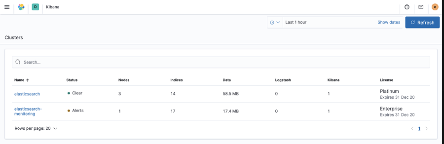
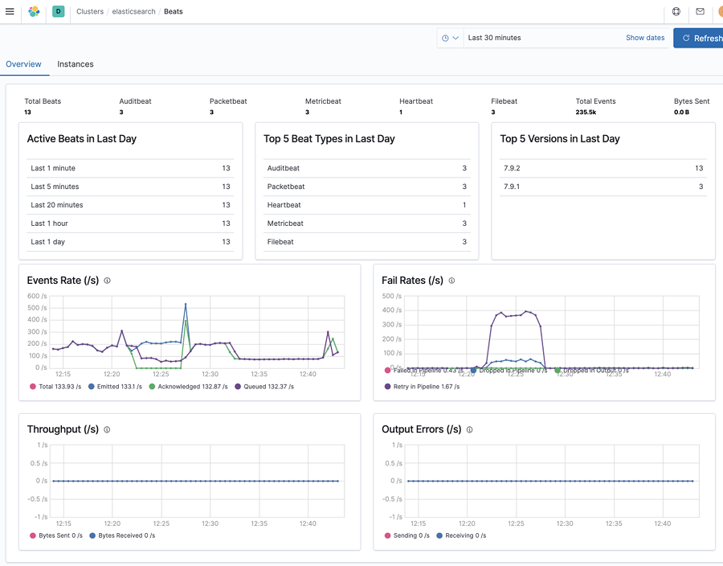
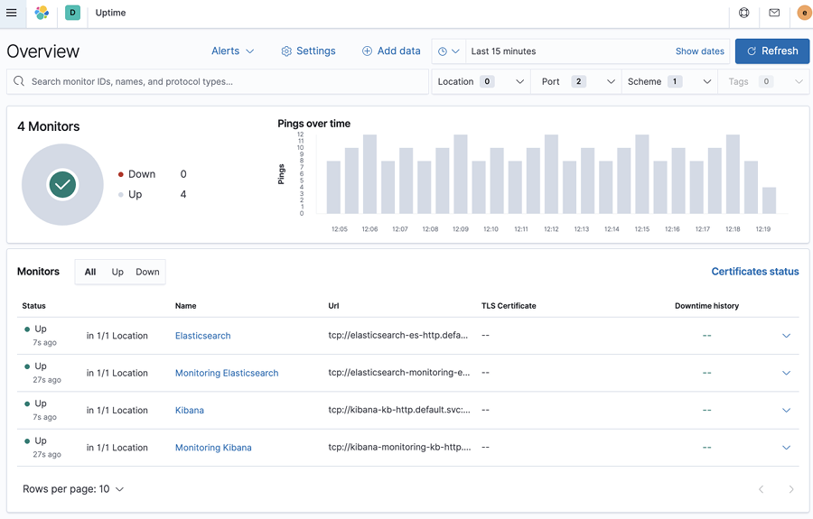
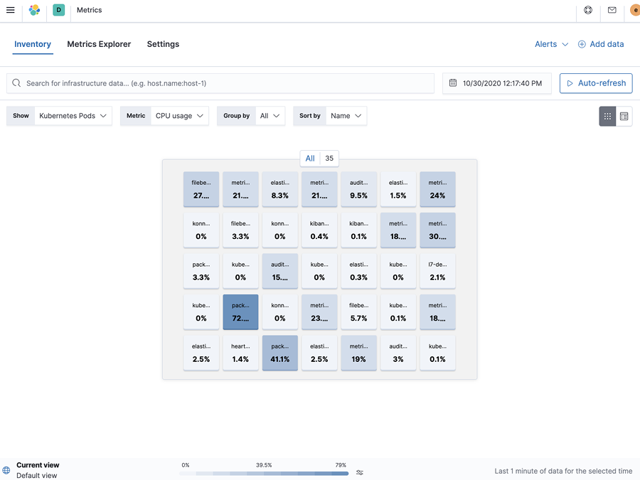
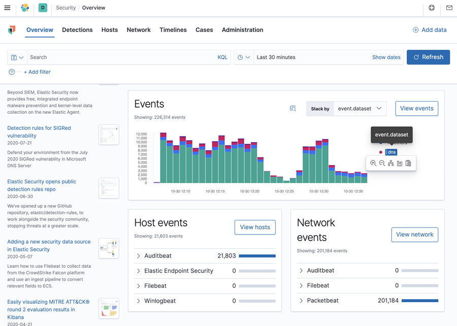

# Monitoring Example

This is an monitoring deployment example, not meant for production. We will deploy, based on https://www.elastic.co/guide/en/cloud-on-k8s/current/k8s-beat-configuration-examples.html:

- A 3-node Elasticsearch cluster, where we'll collect different information using Beats.
- 1 Kibana instance published via Load Balancer.
- A 1-node Elasticsearch dedicated monitoring cluster to monitor the above deployment and all Beats.
- 1 Kibana instance published via Load Balancer.
- A Metricbeat DaemonSet with Autodiscover to collect Kubernetes host metrics.
- A Filebeat DaemonSet with Autodiscover to collect Kubernetes logs.
- A Metricbeat to collect Elasticsearch, Kibana - [metricbeat collection](https://www.elastic.co/guide/en/beats/metricbeat/current/monitoring-metricbeat-collection.html) - and Beats metrics - [internal collection](https://www.elastic.co/guide/en/beats/metricbeat/current/monitoring-internal-collection.html).
- A Heartbeat to monitor Elasticsearch and Kibana.
- An Auditbeat DaemonSet that checks file integrity and audits file operations on the host system.
- A Packetbeat DaemonSet that monitors `DNS` on port `53` and `HTTP(S)` traffic on ports `80`, `8000`, `8080` and `9200`.

We will also: 

- Start a trial or install an ECK license, so all clusters will get a Platinum license, with all the features.
- Optionally run eck dump to extract meaningful troubleshooting information: https://github.com/elastic/cloud-on-k8s/blob/master/hack/diagnostics/eck-dump.sh
    - For troubleshooting common issues: https://www.elastic.co/guide/en/cloud-on-k8s/1.2/k8s-troubleshooting.html

## Deployment

- **TODO**: Review using https://www.elastic.co/blog/elastic-stack-monitoring-with-elastic-cloud-on-kubernetes, change scrape labels to `stack-monitoring.elastic.co/type`
- Follow instructions to create a GKE cluster [here](./README.md#create-a-gke-cluster).
- Install ECK as detailed [here](./README.md#install-eck).
- Apply a license: https://www.elastic.co/guide/en/cloud-on-k8s/1.2/k8s-licensing.html

    - Either start a trial:

        ```yaml
        cat <<EOF | kubectl apply -f -
        apiVersion: v1
        kind: Secret
        metadata:
        name: eck-trial-license
        namespace: elastic-system
        labels:
            license.k8s.elastic.co/type: enterprise_trial
        annotations:
            elastic.co/eula: accepted 
        EOF
        ```

    - Or install your license.

        ```shell
        kubectl create secret generic eck-license --from-file=my-license-file.json -n elastic-system
        kubectl label secret eck-license "license.k8s.elastic.co/scope"=operator -n elastic-system
        ```

    - Check the installed license `kubectl -n elastic-system get configmap elastic-licensing -o json | jq .data`.

- Deploy the stack with [monitoring-stack.yaml](./monitoring-stack.yaml).

    ```
    kubectl apply -f monitoring-stack.yaml
    ```

- Get elastic user password. E.g.: 36Lz5p3hJH5517sKp5SFO6Dr

    ```shell
    kubectl get secret elasticsearch-es-elastic-user -o=jsonpath='{.data.elastic}' | base64 --decode

    36Lz5p3hJH5517sKp5SFO6Dr%
    ```

- Get elastic monitoring user password: E.g.: 740wbB1zC23ja8M2UFN45nji

    ```shell
    kubectl get secret elasticsearch-monitoring-es-elastic-user -o=jsonpath='{.data.elastic}' | base64 --decode

    740wbB1zC23ja8M2UFN45nji%
    ```

- `kubectl get services` to get the service public IPs:

    ```
    NAME                                    TYPE           CLUSTER-IP    EXTERNAL-IP    PORT(S)          AGE
    elasticsearch-es-default                ClusterIP      None          <none>         9200/TCP         22m
    elasticsearch-es-http                   ClusterIP      10.0.93.104   <none>         9200/TCP         22m
    elasticsearch-es-transport              ClusterIP      None          <none>         9300/TCP         22m
    elasticsearch-monitoring-es-default     ClusterIP      None          <none>         9200/TCP         22m
    elasticsearch-monitoring-es-http        ClusterIP      10.0.81.27    <none>         9200/TCP         22m
    elasticsearch-monitoring-es-transport   ClusterIP      None          <none>         9300/TCP         22m
    kibana-kb-http                          LoadBalancer   10.0.86.81    34.77.183.71   5601:32431/TCP   5m49s
    kibana-monitoring-kb-http               LoadBalancer   10.0.93.68    34.78.252.4    5601:30939/TCP   22m
    kubernetes                              ClusterIP      10.0.80.1     <none>         443/TCP          75m
    ```

- Go to http://34.77.183.71:5601 for the monitored cluster, and https://34.78.252.4:5601 for the monitoring cluster.
- In the monitoring Kibana URL (in the example https://34.78.252.4:5601), go to Stack Monitoring and you should see both clusters being monitored.

    

- If we select `elasticsearch` cluster, we can check the Beats sending data to that cluster. Beats will appear in Monitoring UI under the cluster they are sending data to, so some will appear under `elasticsearch-monitoring`.

    

- We can also go to the monitored cluster, in the example http://34.77.183.71:5601, and check what is under the Observability or Security Apps.

    - Heartbeat monitors.

        
    
    - Kubernetes Metrics.

        
    
    - Security Overview (Auditbeat, Packetbeat, ...): 

        

### Known issues in the example

- When attemping to [setup Kibana](https://www.elastic.co/guide/en/cloud-on-k8s/1.2/k8s-beat-configuration.html#k8s-beat-set-up-kibana-dashboards) for Beats, the first pod might suceed in doing so, but the rest will fail to authenticate with the user they create. So this is commented in the example after initially created:

    ```yaml
        #Uncomment to setup dashboards
        #kibanaRef:
        #  name: kibana
    ```

- Uncommenting this will allow setup to happen, but the DaemonSet restart will fail on the pods until it's commented out again. 
- Workaround can be deleting the associated secret with the user password while pods are bootlooping: `default-metricbeat-ds-beat-kb-user`, `default-metricbeat-beat-kb-user`, `default-heartbeat-ds-beat-kb-user`, etc. The password is recreated and setup succeds. Then comment and re-deploy.

## Delete elastic resources

- Remove the Stack deployment:

    ```shell
    kubectl delete -f monitoring-stack.yaml
    ```
​
- Remove the operator.

    ```shell
    kubectl delete -f https://download.elastic.co/downloads/eck/1.2.0/all-in-one.yaml
    ```


## Follow-up GH issues

- Related to stack monitoring with ECK: https://github.com/elastic/cloud-on-k8s/issues/2415
