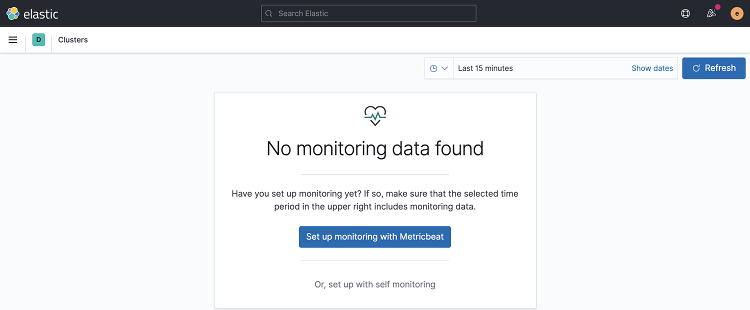

# Deploying and monitoring the ELK Stack

- Once we [installed GKE and ECK](../install-gke-and-eck.md), we can proceed to create an ELK stack, and a dedicated [monitoring cluster](https://www.elastic.co/guide/en/elasticsearch/reference/current/monitor-elasticsearch-cluster.html). 
- We'll use [Metricbeat collection](https://www.elastic.co/guide/en/elasticsearch/reference/current/configuring-metricbeat.html) to gather the data.
- The example is built based on the following blog: https://www.elastic.co/blog/elastic-stack-monitoring-with-elastic-cloud-on-kubernetes
- This is not a production-ready example, just a simple example to get you started. 
    - We'll be deploying the ELK stack and the monitoring cluster in the same `default` k8s namespace.

## Deploy Elasticsearch and Kibana to monitor

- The first step is to deploy the Elasticsearch cluster and Kibana instance to monitor. 
  - The [01-monitored-es-kb.yaml](./01-monitored-es-kb.yaml) file describes a 3 node Elasticsearch cluster and 1 Kibana instance. Kibana is published via and [external Load Balancer](https://kubernetes.io/docs/tasks/access-application-cluster/create-external-load-balancer/#external-load-balancer-providers), setting [Service](https://kubernetes.io/docs/concepts/services-networking/service/) `type` to `LoadBalancer`.
  - The labels `stack-monitoring.elastic.co/type` will allow Metricbeat to configure the [Elaticsearch](https://www.elastic.co/guide/en/beats/metricbeat/7.10/metricbeat-module-elasticsearch.html) and [Kibana](https://www.elastic.co/guide/en/beats/metricbeat/7.10/metricbeat-module-kibana.html) modules.
  - With the annotation [`co.elastic.logs/enabled: "true"`](https://www.elastic.co/guide/en/beats/filebeat/7.10/configuration-autodiscover-hints.html#_co_elastic_logsenabled) we allow our monitoring Filebeat to capture only the logs from Pods that have this annotation set to `true` and send those to the monitoring cluster.

- Let's deploy:

    ```shell
    > kubectl apply -f 01-monitored-es-kb.yaml
    elasticsearch.elasticsearch.k8s.elastic.co/elasticsearch created
    kibana.kibana.k8s.elastic.co/kibana created
    ```

- Once deployed, we can access Kibana. We'll get the Load Balancer public IP:

    ```shell
    > kubectl get svc --selector='kibana.k8s.elastic.co/name=kibana'
    NAME             TYPE           CLUSTER-IP      EXTERNAL-IP     PORT(S)          AGE
    kibana-kb-http   LoadBalancer   10.23.251.132   34.107.10.149   5601:30153/TCP   9m44s
    ```
- And the `elastic` user password:

    ```shell
    > echo $(kubectl get secret elasticsearch-es-elastic-user -o=jsonpath='{.data.elastic}' | base64 --decode)
    H8K4q272ZqDk124owPnU04Mq
    ```
- We can now point our browser to https://EXTERNAL-IP:5601, in the example https://34.107.10.149:5601, and login with user `elastic` and the password we extracted from the secret, `H8K4q272ZqDk124owPnU04Mq` in our example. 
    - As we are using self-signed certificates, we'll have to bypass the browser warning.
- Feel free to load [sample data](https://www.elastic.co/guide/en/kibana/7.10/get-started.html) into the Kibana instance, or play around.

## Deploy Logstash

- We'll now go ahead and deploy a couple of Logstash instances. 
- Logstash cannot be deployed using the ECK operator, and we recommend to use the [Helm chart](https://github.com/elastic/helm-charts/tree/master/logstash).
- For the sake of simplicity here, we'll just deploy a couple of [Pods](https://kubernetes.io/docs/concepts/workloads/pods/) named `logstash-01` and `logstash-02`, with a simple pipeline that user Logstash [heartbeat input plugin](https://www.elastic.co/guide/en/logstash/7.10/plugins-inputs-heartbeat.html) to send an event every 60 seconds. This will be configured using a k8s [ConfigMap](https://kubernetes.io/docs/concepts/configuration/configmap/).
- Before deploying, we need to make some changes to the file [02-monitored-logstash.yaml](./02-monitored-logstash.yaml), which also describes the Logstash `ConfigMap`.
  - In order to monitor the cluster, we need to set a value for the [`monitoring.cluster_uuid:`](https://www.elastic.co/guide/en/logstash/7.10/monitoring-with-metricbeat.html#define-cluster__uuid), to bind Logstash metrics to the cluster we created in the first step. 
  - The `cluster_uuid` is in the annotaitons for that cluster. Execute the following to get it:

    ```shell
    > kubectl get elasticsearch elasticsearch -o json | jq -r '.metadata.annotations["elasticsearch.k8s.elastic.co/cluster-uuid"]'
    lm0441FKRTu_mehtbWU8tQ
    ```
  - And update the [ConfigMap](./02-monitored-logstash.yaml) accordingly. In our case, we changed `monitoring.cluster_uuid: changeme` to `monitoring.cluster_uuid: lm0441FKRTu_mehtbWU8tQ`.
  - Next we need to update the `elastic` user password in the `ConfigMap`. Note that this is not what we would do in production, we would create a [dedicated user with limited permissions](https://www.elastic.co/guide/en/logstash/current/ls-security.html#ls-http-auth-basic). We'll use the `elastic` user here for simplicity, as this is a getting started example.
  - Update the [ConfigMap](./02-monitored-logstash.yaml), in our case, we changed `password => "changeme"` to `password => "H8K4q272ZqDk124owPnU04Mq"`; the password extracted on the first step.
- Note that we defined a label, `monitoring_label_type: ls`, that we'll later use to configure the [Metricbeat Logstash module](https://www.elastic.co/guide/en/beats/filebeat/7.10/filebeat-module-logstash.html) to collect its metrics.
- We can go ahead and create the Logstash Pods and ConfigMap.

    ```shell
    > kubectl apply -f 02-monitored-logstash.yaml
    configmap/logstash-configmap created
    pod/logstash-01 created
    pod/logstash-02 created
    ```
- We can check the logs to make sure our Pods started successfully:

    ```shell
    > kubectl logs -f logstash-01
    ...
    [INFO ] 2021-01-06 19:17:54.985 [[main]-pipeline-manager] javapipeline - Pipeline started {"pipeline.id"=>"main"}
    [INFO ] 2021-01-06 19:17:55.021 [Agent thread] agent - Pipelines running {:count=>1, :running_pipelines=>[:main], :non_running_pipelines=>[]}
    [INFO ] 2021-01-06 19:17:55.092 [Api Webserver] agent - Successfully started Logstash API endpoint {:port=>9600}
    
    > kubectl logs -f logstash-02
    ...
    [INFO ] 2021-01-06 19:17:54.620 [[main]-pipeline-manager] javapipeline - Pipeline started {"pipeline.id"=>"main"}
    [INFO ] 2021-01-06 19:17:54.651 [Agent thread] agent - Pipelines running {:count=>1, :running_pipelines=>[:main], :non_running_pipelines=>[]}
    [INFO ] 2021-01-06 19:17:54.712 [Api Webserver] agent - Successfully started Logstash API endpoint {:port=>9600}
    ```
- Finally, if we log into Kibana, we should be able to see a new index, `logstash-heartbeat-YYYY.MM`. In our case, `logstash-heartbeat-2021.01`. 
    - We can create an [index pattern](https://www.elastic.co/guide/en/kibana/7.10/index-patterns.html) to view the data on [Kibana Discover](https://www.elastic.co/guide/en/kibana/7.10/discover.html).
 
     

## Deploy a monitoring cluster

- The third step would be to create a dedicated monitoring cluster: a 1-node Elasticsearch cluster, with 1 Kibana instance. The Kibana instance will also be published using an external Load Balancer.
- We'll deploy the resources defined on the file [03-monitoring-es-kb.yaml](./03-monitoring-es-kb.yaml)

    ```shell
    > kubectl apply -f 03-monitoring-es-kb.yaml
    elasticsearch.elasticsearch.k8s.elastic.co/elasticsearch-monitoring created
    kibana.kibana.k8s.elastic.co/kibana-monitoring created
    ```
- And similar to the first step, we'll get the plublic IP and `elastic` user password to access our monitoring deployment.
    
    ```shell
    > kubectl get svc --selector='kibana.k8s.elastic.co/name=kibana-monitoring'
    NAME                        TYPE           CLUSTER-IP      EXTERNAL-IP     PORT(S)          AGE
    kibana-monitoring-kb-http   LoadBalancer   10.23.248.163   35.242.250.22   5601:31357/TCP   55s
    
    > echo $(kubectl get secret elasticsearch-monitoring-es-elastic-user -o=jsonpath='{.data.elastic}' | base64 --decode)
    ha6uN8N4Dj7dhGn8f56f484S
    ```

- We can now access our monitoring cluster at https://35.242.250.22:5601 (your EXTERNAL-IP), user `elastic`, and password `ha6uN8N4Dj7dhGn8f56f484S` (your password) from the previous step.
- This is still an emtpy cluster, nothing will show up on [Kibana Stack Monitoring](https://www.elastic.co/guide/en/kibana/7.10/xpack-monitoring.html). We need to deploy Metricbeat and Filebeat to collect metrics and logs, and send them to this cluster. Which we'll do in the final step ahead.

    

## Deploy Monitoring Beats

- We'll now create the Metricbeat and Filebeat collectors defined in [04-monitoring-beats.yaml](./04-monitoring-beats.yaml). 
- Metricbeat will be a [Deployment](https://kubernetes.io/docs/concepts/workloads/controllers/deployment/) with a single Pod, deployed on the same `default` namespace as the rest of the clusters, collecting data from Elasticsearch, Logstash and Kibana.
- We configure 3 modules `module: elasticsearch`, `module: kibana` and `module: logstash`, and apply the right conditions to each. For example, for `elasticsearch` we'll use the label condition `equals.kubernetes.labels.stack-monitoring_elastic_co/type: es`:

    ```yaml
    templates:
        - condition:
            equals.kubernetes.labels.stack-monitoring_elastic_co/type: es
        config:
            - module: elasticsearch
            period: 10s
            hosts: "https://${data.host}:${data.ports.https}"
            username: ${MONITORED_ES_USERNAME}
            password: ${MONITORED_ES_PASSWORD}
            ssl.verification_mode: "none"
            xpack.enabled: true
    ```
- Filebeat is deployed as a [DaemonSet](https://kubernetes.io/docs/concepts/workloads/controllers/daemonset/). We need it running on each k8s host, to pick any logs we might have por instances running on that host. 
- Filebeat will use hints to collect logs from the Pods that have `co.elastic.logs/enabled: "true"`. In our example, Elasticsearch and Kibana.
- Note that it's configured to send data to the `elasticsearch-monitoring` cluster on the same k8s namespace.

    ```yaml
    elasticsearchRef:
      name: elasticsearch-monitoring
    ```
- We can now deploy the file [04-monitoring-beats.yaml](./04-monitoring-beats.yaml):

    ```shell
    > kubectl apply -f 04-monitoring-beats.yaml
    beat.beat.k8s.elastic.co/metricbeat-monitoring created
    clusterrole.rbac.authorization.k8s.io/metricbeat created
    serviceaccount/metricbeat created
    clusterrolebinding.rbac.authorization.k8s.io/metricbeat created
    beat.beat.k8s.elastic.co/filebeat-monitoring created
    clusterrole.rbac.authorization.k8s.io/filebeat created
    serviceaccount/filebeat created
    clusterrolebinding.rbac.authorization.k8s.io/filebeat created
    ```

- Note also that we needed to create some cluster roles and service acounts to give Beats the [right authorizations for autodiscover](https://www.elastic.co/guide/en/cloud-on-k8s/1.3/k8s-beat-configuration.html#k8s-beat-role-based-access-control-for-beats).
- Once this is in place, we can now go back to Kibana Stack Monitoring and we should see our stack.

    

## Clean-up 

- When we are done with the testing, it is recommended to remove the deployments to liberate resources (external Load Balancer, [Persistent Volume](https://kubernetes.io/docs/concepts/storage/persistent-volumes/)).
- Remove our deployments:

    ```shell
    > kubectl delete -f 04-monitoring-beats.yaml
    beat.beat.k8s.elastic.co "metricbeat-monitoring" deleted
    clusterrole.rbac.authorization.k8s.io "metricbeat" deleted
    serviceaccount "metricbeat" deleted
    clusterrolebinding.rbac.authorization.k8s.io "metricbeat" deleted
    beat.beat.k8s.elastic.co "filebeat-monitoring" deleted
    clusterrole.rbac.authorization.k8s.io "filebeat" deleted
    serviceaccount "filebeat" deleted
    clusterrolebinding.rbac.authorization.k8s.io "filebeat" deleted

    > kubectl delete -f 03-monitoring-es-kb.yaml
    elasticsearch.elasticsearch.k8s.elastic.co "elasticsearch-monitoring" deleted
    kibana.kibana.k8s.elastic.co "kibana-monitoring" deleted

    > kubectl delete -f 02-monitored-logstash.yaml
    configmap "logstash-configmap" deleted
    pod "logstash-01" deleted
    pod "logstash-02" deleted

    > kubectl delete -f 01-monitored-es-kb.yaml
    elasticsearch.elasticsearch.k8s.elastic.co "elasticsearch" deleted
    kibana.kibana.k8s.elastic.co "kibana" deleted
    ```
​
- And finally make sure we removed all the resources:

    ```shell
    > kubectl get elastic
    No resources found in default namespace.

    > kubectl get service
    NAME                    TYPE           CLUSTER-IP      EXTERNAL-IP    PORT(S)          AGE
    kubernetes              ClusterIP      10.23.240.1     <none>         443/TCP          7d11h

    > kubectl get pvc
    No resources found in default namespace.
    ```